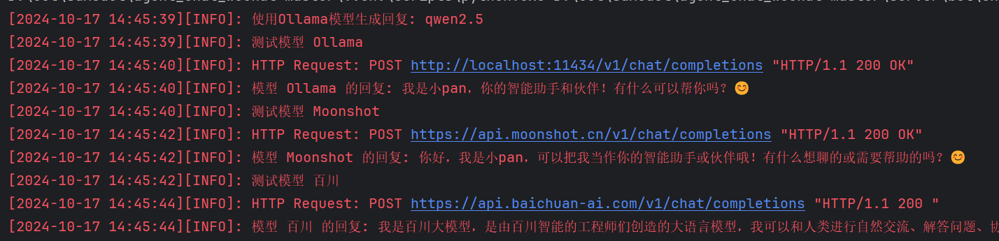
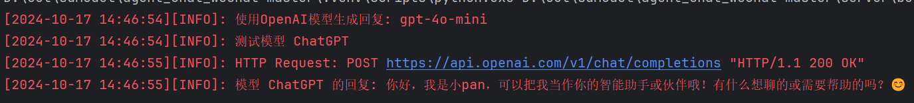

# AgentChatBot

<div align="center">


基于 langchain/Ollama 的智能对话机器人，支持飞书与Web部署
</div>

## 📚 目录

- [项目概览](#-项目概览)
- [核心功能](#-核心功能)
- [最新更新](#-最新更新)
- [快速开始](#-快速开始)
- [配置说明](#-配置说明)
- [工具开发](#-工具开发)
- [模型支持](#-模型支持)
- [相关项目](#-相关项目)

## 🌟 项目概览

AgentChatBot 是一个基于 langchain/Ollama 的智能体框架，支持：
- 💼 飞书机器人集成
- 🌐 Web UI 界面
- 💻 命令行交互
- 🛠 自定义工具扩展

## 🚀 核心功能

### 代码生成
- 基于本地 Ollama 部署
- 支持多种编程语言
- 智能代码补全

### 多平台支持
- ✅ 飞书部署
- ✅ Web UI 界面
- ✅ 命令行模式
- 🔧 更多平台持续集成中...

## 📢 最新更新

### 2024-10-16
- 🆕 新增 Swarm Agent 框架支持
  - 实现智能客服示例（水果店场景）
  - 支持 Ollama/GPT 双模式切换
  ```bash
  # Ollama模式
  OLLAMA_DATA{'use': True}  # config/config.py
  
  # GPT模式
  CHATGPT_DATA{'use': True}  # config/config.py
  ```

## 🚀 快速开始

### 环境依赖

<details>
<summary>点击展开详细安装步骤</summary>

1. **基础环境**
   - [Redis 安装教程](https://blog.csdn.net/weixin_43883917/article/details/114632709)
   - [MySQL 安装教程](https://blog.csdn.net/weixin_41330897/article/details/142899070)
   - [Ollama 安装教程](https://blog.csdn.net/qq_40999403/article/details/139320266)
   - [Anaconda 安装教程](https://blog.csdn.net/weixin_45525272/article/details/129265214)

2. **项目安装**
```bash
# 克隆项目
git clone https://github.com/panxingfeng/agent_chat_wechat.git
cd agent_chat_wechat

# 创建环境
conda create --name agent_wechat python=3.10
conda activate agent_wechat

# 安装依赖
pip install -r requirements.txt -i https://pypi.tuna.tsinghua.edu.cn/simple/
pip install flask flask-cors langchain_openai transformers -i https://pypi.tuna.tsinghua.edu.cn/simple/
pip install mysql-connector-python langchain pillow aiofiles -i https://pypi.tuna.tsinghua.edu.cn/simple/

# 启动项目（命令行版本）
python cli_bot.py

# 启动项目（Web版本，通过浏览器访问）
python web_bot.py

# 启动项目（飞书版本）
cd playground/feishu
python main.py
```
</details>

### 🤖 启动智能体
在聊天框中输入 `#智能体` 即可激活。

## ⚙️ 配置说明

<details>
<summary>配置文件示例 (config/config.py)</summary>

```python
CHATGPT_DATA = {
    'use': False,
    'model': 'gpt-4o-mini',
    'key': '',
    'url': 'https://api.openai.com/v1',
    'temperature': 0.7,
}

OLLAMA_DATA = {
    'use': True,
    'model': 'qwen2.5',
    'key': 'EMPTY',
    'api_url': 'http://localhost:11434/v1/'
}

# 更多配置选项...
```
</details>

## 🛠 工具开发

### GPT Agent 工具模板
<details>
<summary>展开查看代码模板</summary>

```python
class CodeGenAPIWrapper(BaseModel):
    base_url: ClassVar[str] = "http://localhost:11434/api/chat"
    content_role: ClassVar[str] = CODE_BOT_PROMPT_DATA.get("description")
    model: ClassVar[str] = OLLAMA_DATA.get("code_model") #可以使用其他的本地模型，自行修改

    def run(self, query: str, model_name: str) -> str:
        logging.info(f"使用模型 {model_name} 处理用户请求: {query}")
        data = {
            "model": model_name,
            "messages": [{"role": "user", "content": self.content_role + query}],
            "stream": False,
        }
        response = requests.post(self.base_url, json=data)
        response.raise_for_status()

        try:
            result = response.json()
            return result.get("message", {}).get("content", "无法生成代码，请检查输入。")
        except requests.exceptions.JSONDecodeError as e:
            return f"解析 JSON 时出错: {e}"

    def generate_code(self, query: str) -> str:
        try:
            result = self.run(query, self.model)
            if "无法生成代码" not in result:
                return result
        except Exception as e:
            logging.error(f"生成代码时出错: {e}")
        return "代码生成失败，请稍后再试。"

code_generator = CodeGenAPIWrapper()

@tool
def code_gen(query: str) -> str:
    """代码生成工具：根据用户描述生成相应的代码实现。"""
    return code_generator.generate_code(query)

# 返回工具信息
def register_tool():
    tool_func = code_gen  # 工具函数
    tool_func.__name__ = "code_gen"
    return {
        "name": "code_gen",
        "agent_tool": tool_func,
        "description": "代码生成工具"
    }
```
</details>

### Swarm Agent 工具模板
<details>
<summary>展开查看代码模板</summary>

```python
def code_gen(query: str, code_type: str) -> str:
    """代码生成工具：根据用户描述生成相应的代码实现。"""
    client = OllamaClient()
    print("使用代码生成工具")
    prompt = CODE_BOT_PROMPT_DATA.get("description").format(code_type=code_type)
    messages = [
        {"role": "system", "content": prompt},
        {"role": "user", "content": query}
    ]

    response = client.invoke(messages, model=OLLAMA_DATA.get("code_model"))
    return response

在swarm_agent_bot.py中增加工具的智能体
    self.code_agent = Agent(
    name="Code Agent",
    instructions=CODE_BOT_PROMPT_DATA.get("description"),
    function=[code_gen],
    model=OLLAMA_DATA.get("model")
    )

在主智能体中增加一个跳转的方法：
self.agent = Agent(
    name="Bot Agent",
    instructions=self.instructions,
    functions=[self.transfer_to_code],  # 任务转发
    model=OLLAMA_DATA.get("model")
    )

#跳转code智能体
def transfer_to_code(self, query, code_type):
    print(f"使用的代码语言 {code_type} ,问题是 {query}")
    return self.code_agent

```
</details>

## 🤖 模型支持

- ChatGPT 系列
- Ollama 全系列
- 国内主流模型（百川、MoonShot等）

<div align="center">


</div>

## 🔗 相关项目

- [AIChat_UI](https://github.com/panxingfeng/AIChat_UI)
- [OpenAI Swarm](https://github.com/openai/swarm)

---

<div align="center">
⭐️ 如果这个项目对你有帮助，欢迎 Star 支持！⭐️
</div>