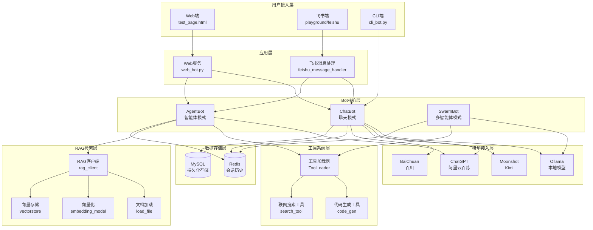

# AgentChatBot 项目架构说明

## 📋 项目概述

**AgentChatBot** 是一个基于 LangChain 和 Ollama 的多智能体对话系统，支持飞书和Web端部署，提供聊天模式和智能体模式，具备工具调用、RAG检索增强等高级功能。

---

## 🏗️ 系统架构图



---

## 📁 项目目录结构

```
agent_chat_wechat/
├── config/                          # 配置文件目录
│   ├── templates/data/
│   │   └── bot.py                   # Bot配置和Prompt模板
│   └── config.py                    # 全局配置（模型、数据库等）
│
├── server/                          # 服务端核心代码
│   ├── bot/                         # Bot实现
│   │   ├── chat_bot.py             # 聊天模式Bot
│   │   ├── agent_bot.py            # 智能体模式Bot
│   │   └── swarm_agent_bot.py      # 多智能体模式Bot
│   │
│   ├── client/                      # 模型客户端
│   │   ├── loadmodel/Ollama/
│   │   │   └── OllamaClient.py     # Ollama本地模型客户端
│   │   └── online/
│   │       ├── moonshotClient.py   # Moonshot客户端
│   │       └── BaiChuanClient.py   # 百川客户端
│   │
│   └── rag/v1/                      # RAG检索增强模块
│       ├── chatmodel/               # 对话模型
│       ├── embedding/               # 向量化模型
│       ├── vectorstore/             # 向量数据库
│       ├── tool/                    # RAG工具
│       └── rag_client.py           # RAG客户端
│
├── tools/                           # 工具系统
│   ├── agent_tool/                  # Agent工具
│   │   ├── code_gen/               # 代码生成工具
│   │   └── search_tool/            # 搜索工具
│   ├── swarm_tool/                  # Swarm工具
│   ├── file_processor.py            # 文件处理器
│   └── tool_loader.py              # 工具加载器
│
├── playground/                      # 实验性功能
│   ├── feishu/                      # 飞书集成
│   │   ├── main.py                 # 飞书主程序
│   │   ├── feishu_message_handler.py  # 飞书消息处理
│   │   ├── aes_cipher_client.py    # AES加密
│   │   └── send_message.py         # 发送消息
│   └── swarm_agent/                 # Swarm测试
│       └── main.py                 # Swarm演示
│
├── cli_bot.py                       # 命令行版本入口
├── web_bot.py                       # Web版本入口
├── test_page.html                   # Web界面
└── requirements.txt                 # 项目依赖

已删除文件：
- main.py                            # 微信接入入口（已删除）
- server/message/                    # 微信消息处理（已删除）
```

---

## 🎯 核心功能模块

### 1. **用户接入层**

#### Web端 (web_bot.py + test_page.html)
- **功能**：提供Web UI界面，通过浏览器访问
- **技术**：Flask + SSE流式输出 + Markdown渲染
- **特点**：
  - 支持流式打字效果
  - 代码高亮显示（highlight.js）
  - 历史记录管理
  - 模式切换（聊天/智能体）

#### 飞书端 (playground/feishu/)
- **功能**：集成飞书开放平台API
- **技术**：Flask + 事件订阅 + AES加密
- **特点**：
  - 支持私聊和群聊
  - 消息加密传输
  - @机器人触发
  - URL验证

#### CLI端 (cli_bot.py)
- **功能**：命令行交互界面
- **技术**：Python asyncio
- **特点**：
  - 无需登录
  - 快速测试
  - 模式切换

---

### 2. **Bot核心层**

#### ChatBot（聊天模式）
**文件**：`server/bot/chat_bot.py`

**核心功能**：
- ✅ 基础对话
- ✅ 多模型支持（Ollama/ChatGPT/Moonshot/百川）
- ✅ 历史记录管理（Redis）
- ✅ 智能裁剪（保留最近6轮对话）

**流程**：
```
用户输入 → 获取历史 → 模型推理 → 生成回复 → 保存历史
```

**适用场景**：
- 日常闲聊
- 简单问答
- 快速响应

---

#### AgentBot（智能体模式）
**文件**：`server/bot/agent_bot.py`

**核心功能**：
- ✅ 工具调用（代码生成、联网搜索）
- ✅ ReAct推理框架（思考-行动-观察）
- ✅ 任务分解与执行
- ✅ 基于LangChain AgentExecutor

**工作原理**：
```
用户任务 → Agent分析 → 选择工具 → 执行工具 → 整合结果 → 返回答案
```

**关键技术**：
- `bind_tools()`：绑定工具到模型
- `format_to_openai_tool_messages`：格式化工具消息
- `OpenAIToolsAgentOutputParser`：解析输出

**适用场景**：
- 代码生成
- 信息检索
- 复杂任务处理

---

#### SwarmBot（多智能体模式）
**文件**：`server/bot/swarm_agent_bot.py`

**核心功能**：
- ✅ 多智能体协作
- ✅ 任务转发机制
- ✅ 专家分工（代码专家、搜索专家等）
- ✅ 基于OpenAI Swarm框架

**架构**：
```
主智能体 (Bot Agent)
    ├── 代码智能体 (Code Agent)
    ├── 搜索智能体 (Search Agent)
    └── 其他专家智能体...
```

**适用场景**：
- 多领域任务
- 复杂工作流
- 协同问题解决

---

### 3. **模型接入层**

#### 支持的模型

| 模型类型 | 客户端 | 特点 |
|---------|--------|------|
| **Ollama** | OllamaClient.py | 本地部署、免费、隐私安全 |
| **ChatGPT** | ChatOpenAI | 云端API、效果好、支持阿里云百炼 |
| **Moonshot** | moonshotClient.py | Kimi模型、长文本 |
| **百川** | BaiChuanClient.py | 国产模型 |

#### 模型配置示例
```python
# config/config.py
OLLAMA_DATA = {
    'use': True,
    'model': 'qwen:1.8b',
    'api_url': 'http://localhost:11434/v1/'
}

CHATGPT_DATA = {
    'use': True,
    'model': 'qwen-plus',
    'key': 'your-api-key',
    'url': 'https://dashscope.aliyuncs.com/compatible-mode/v1'
}
```

---

### 4. **工具系统层**

#### 工具加载器 (ToolLoader)
**文件**：`tools/tool_loader.py`

**功能**：
- 动态扫描工具目录
- 自动注册工具
- 统一工具接口

**加载流程**：
```python
tool_loader = ToolLoader()
tool_loader.load_tools()  # 扫描并加载所有工具
tools = tool_loader.get_tools()  # 获取工具列表
```

---

#### 代码生成工具 (code_gen)
**文件**：`tools/agent_tool/code_gen/tool.py`

**功能**：
- 根据自然语言生成代码
- 支持多种编程语言
- 智能代码补全

**调用示例**：
```python
@tool
def code_gen(query: str) -> str:
    """代码生成工具：根据用户描述生成相应的代码实现。"""
    # 调用Ollama模型生成代码
    return code_generator.generate_code(query)
```

---

#### 联网搜索工具 (search_tool)
**文件**：`tools/agent_tool/search_tool/tool.py`

**功能**：
- 多搜索引擎支持（Tavily、DuckDuckGo）
- 智能降级机制
- AI摘要功能

**搜索引擎优先级**：
```
Tavily（付费、效果好） → DuckDuckGo（免费、兜底）
```

---

### 5. **RAG检索增强层**

**目录**：`server/rag/v1/`

#### 核心组件

| 组件 | 功能 |
|------|------|
| **文档加载器** | 支持Word、PDF、Markdown等格式 |
| **向量化模型** | Ollama Embedding本地向量化 |
| **向量数据库** | FAISS/Chroma向量存储 |
| **RAG客户端** | 检索+生成一体化 |

#### RAG工作流程
```
用户问题 → 向量化 → 相似度检索 → 提取TopK文档 → 结合问题+文档 → LLM生成答案
```

---

### 6. **数据存储层**

#### Redis（会话历史）
**用途**：
- 存储对话历史（最近6轮）
- 快速读写
- 支持过期策略

**存储格式**：
```json
{
  "chat_history:user_123": [
    {"Human": "你好"},
    {"Human": "今天天气怎么样"}
  ]
}
```

---

#### MySQL（持久化存储）
**用途**：
- 用户信息
- 重要对话记录
- 数据统计分析

**表结构示例**：
```sql
CREATE TABLE messages (
    id INT AUTO_INCREMENT PRIMARY KEY,
    user_name VARCHAR(255),
    message_text TEXT,
    timestamp TIMESTAMP
);
```

---

## 🔧 启动方式

### 1. Web版本
```bash
python web_bot.py
# 访问: http://127.0.0.1:5000
```

### 2. CLI版本
```bash
python cli_bot.py
# 命令：#智能体 | #聊天 | #退出
```

### 3. 飞书版本
```bash
cd playground/feishu
python main.py
# 配置飞书webhook URL
```

---

## ⚙️ 配置说明

### 模型配置
**文件**：`config/config.py`

```python
# 启用Ollama本地模型
OLLAMA_DATA = {
    'use': True,
    'model': 'qwen:1.8b'
}

# 启用ChatGPT（阿里云百炼）
CHATGPT_DATA = {
    'use': True,
    'model': 'qwen-plus',
    'key': 'sk-xxx',
    'url': 'https://dashscope.aliyuncs.com/compatible-mode/v1'
}
```

### 数据库配置
```python
# Redis配置
REDIS_DATA = {
    'host': 'localhost',
    'port': 6379,
    'db': 0
}

# MySQL配置
DB_DATA = {
    'host': 'localhost',
    'user': 'root',
    'password': '1234',
    'database': 'agent'
}
```

### 搜索工具配置
```python
SEARCH_TOOL_CONFIG = {
    'priority': ['tavily', 'duckduckgo'],
    'tavily': {
        'use': True,
        'api_key': 'tvly-xxx'
    },
    'duckduckgo': {
        'use': True,
        'region': 'wt-wt'
    }
}
```

---

## 🎨 核心技术栈

| 分类 | 技术 |
|------|------|
| **编程语言** | Python 3.10 |
| **AI框架** | LangChain, OpenAI Swarm |
| **本地模型** | Ollama (qwen, deepseek等) |
| **云端模型** | ChatGPT, 阿里云百炼, Moonshot, 百川 |
| **Web框架** | Flask, Flask-CORS |
| **数据库** | Redis, MySQL |
| **文档处理** | PyPDF2, python-docx |
| **向量检索** | FAISS, Chroma |
| **异步框架** | asyncio, aiohttp |

---

## 📊 模式对比

| 特性 | ChatBot | AgentBot | SwarmBot |
|------|---------|----------|----------|
| **复杂度** | 低 | 中 | 高 |
| **响应速度** | 快（1-3秒） | 中（3-10秒） | 慢（10+秒） |
| **工具调用** | ❌ | ✅ | ✅ |
| **多智能体** | ❌ | ❌ | ✅ |
| **适用场景** | 简单问答 | 单任务处理 | 复杂任务协作 |
| **Token消耗** | 低 | 中 | 高 |

---

## 🚀 扩展开发

### 添加新工具
1. 在 `tools/agent_tool/` 创建工具目录
2. 实现 `tool.py` 和 `register_tool()` 函数
3. 工具加载器自动识别

### 添加新模型
1. 在 `server/client/` 创建客户端
2. 实现 `invoke()` 方法
3. 在 `config.py` 添加配置

### 添加新平台
1. 在 `playground/` 创建平台目录
2. 实现消息处理逻辑
3. 调用Bot核心层接口

---

## 📝 开发规范

### 代码风格
- 遵循PEP 8规范
- 使用类型注解
- 完善的日志记录
- 异常处理机制

### 日志格式
```python
logging.basicConfig(
    level=logging.INFO,
    format='[%(asctime)s][%(levelname)s]: %(message)s',
    datefmt='%Y-%m-%d %H:%M:%S'
)
```

### 错误处理
```python
try:
    # 业务逻辑
except Exception as e:
    logging.error(f"错误描述: {e}")
    return "友好的错误提示"
```

---

## 🔒 安全性

- ✅ API Key通过配置文件管理
- ✅ Redis连接失败优雅降级
- ✅ 数据库连接池
- ✅ 飞书消息AES加密
- ✅ 输入验证与过滤

---

## 📈 性能优化

- ✅ 历史记录智能裁剪（最近6轮）
- ✅ Redis缓存提升读写速度
- ✅ 异步处理提高并发能力
- ✅ 连接池复用减少开销

---

## 🎯 未来规划

- [ ] 支持更多平台（钉钉、Telegram）
- [ ] 多模态支持（图像理解、语音识别）
- [ ] Agent监控与调试工具
- [ ] 分布式部署方案
- [ ] 知识库管理界面

---

## 📞 联系方式

如有问题或建议，欢迎通过以下方式联系：
- GitHub Issues
- Email: your-email@example.com

---

**最后更新**: 2026-01-14
**版本**: v2.0（已移除微信接入）
